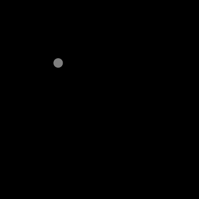
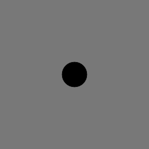

# p5.createLoop

Provides a simple and structured p5 library for creating animation loops in the browser. It is a lightweight wrapper of [createLoop](https://www.npmjs.com/package/createloop).

Features include:
- GIF image rendering
- noise loops

**Ye be warned** This is a baby library and has a lot of growing up to do. Breaking changes ahoy.

## Example


html:
```html
    <script src="https://cdnjs.cloudflare.com/ajax/libs/p5.js/0.8.0/p5.min.js"></script>
    <script src="https://unpkg.com/p5.createloop@latest/dist/p5.createloop.js"></script>
```

javascript:
```js
function setup() {
    createCanvas(400, 400)
    fill(0)
    frameRate(30)
    createLoop({duration:3, gif:true})
}

function draw() {
    background(255)
    translate(width / 2, height / 2)
    const radius = height / 3
    const x = cos(animLoop.theta) * radius
    const y = sin(animLoop.theta) * radius
    ellipse(x, y, 50, 50)
}

```

## More examples

### [Noise Loop](examples/js/noiseLoop.js)

- Begins recording the GIF after the first loop
- x position is cosine of animLoop.theta


### [Noise Loop 2x](examples/js/noiseLoop2x.js)

- two noise seeds, one for x and one for y



### [Noise Loop 1D](examples/js/noiseLoop1d.js)

- a noise value for each x position


### [Noise Loop 2D](examples/js/noiseLoop2d.js)

- a noise value for each x and y position


### [Instance Mode](examples/js/instanceMode.js)

- also works in instance mode




## Documentation

p5.createLoop works to make creating animation loops feel native to p5. The built in p5 `frameRate()` function will also set the delay between GIF frames.

When a sketch is initialized the following are attached to it.

### createLoop()

This function can be called in two ways:
```javascript
createLoop(options)
createLoop(duration,options)
```
It initializes the loop and can receive several options:

| Name              | Default     | Description                                                                                                                                |
| ----------------- | ----------- | ------------------------------------------------------------------------------------------------------------------------------------------ |
| `duration`        | `3`         | sets the duration in seconds of the loop.                                                                                                  |
| `framesPerSecond` | `30`        | approximate fps of the loop                                                                                                                |
| `noise`           | `undefined` | options to be passed to noise module. see [noise options](README.md#noise-options)                                                         |
| `gif`             | `false`     | can accept `true` or `options` to be passed to GIF module. Will not create GIF if left undefined. see [gif options](README.md#gif-options) |

#### noise options

| Name        | Default         | Description                                                                                            |
| ----------- | --------------- | ------------------------------------------------------------------------------------------------------ |
| `frequency` | `1`             | The 'randomness' of the noise. Behind the scenes this sets the radius of a circle in a 2D noise field. |
| `seed`      | `Math.random()` | The seed of the noise field                                                                            |

#### gif options

| Name        | Default    | Description                                                                                                             |
| ----------- | ---------- | ----------------------------------------------------------------------------------------------------------------------- |
| `render`    | `true`     | create an image element and render the GIF to the webpage. Clicking on the image will begin downlaoding the GIF.        |
| `open`      | `false`    | open the gif image in a new tab or window                                                                               |
| `download`  | `false`    | download the gif automatically                                                                                          |
| `startLoop` | `0`        | loop index to begin recording the GIF                                                                                   |
| `endLoop`   | `1`        | loop index to end recording the GIF                                                                                     |
| `canvas`    | `<canvas>` | The canvas to render. By default this is the first instance of a canvas on the webpage                                  |
| `options`   | `{}`       | options to pass to gif.js encoder. see [gif.js documentation](https://github.com/jnordberg/gif.js#user-content-options) |


### animLoop

Because the aim here is to get GIF loopin asap, this object provides some valuable variables for animating loops. See documentation on [Loop Instance](https://github.com/piratesjustar/createLoop#loop-instance) for further details.

| Name               | Description                                                                                                                                                                                                                 |
| ------------------ | --------------------------------------------------------------------------------------------------------------------------------------------------------------------------------------------------------------------------- |
| `progress`         | stage of completion of the loop. this is `elapsedFrames / framesPerLoop` and has a range of `0 to 1`                                                                                                                        |
| `theta`            | progress around a circle with a a range of `0 to TWO_PI`                                                                                                                                                                    |
| `noise()`          | returns a noise value between -1 and 1. This found by querying the position `loop.theta` with radius `noiseFrequency` on a circle in a 2D simplex noise field                                                               |
| `noise1D(x)`       | Same as above also accepting an `x` value, providing a 1D line of noise for each frame                                                                                                                                      |
| `noise2D(x,y)`     | Same as above also accepting a `y` value, providing a 2D plane of noise                                                                                                                                                     |
| `noiseSeed()`      | set the noise seed. Behind the scenes every time this called with a new seed value, a new instance of [simplex-noise](https://github.com/jwagner/simplex-noise.js) is created. see [noise options](README.md#noise-options) |
| `noiseFrequency()` | set the noise frequency, also described as `radius`. see [noise options](README.md#noise-options)                                                                                                                           |


### TODO

- Account for pixel density with GIF size

### patch notes
- 0.0.17 - 15/04/2019
    - updated to createLoop 0.0.6
- 0.0.16 - 15/04/2019
    - can handle webpack without adding p5 to global namespace
- 0.0.15 - 15/04/2019
    - p5 must be externally required
- 0.0.12 - 15/04/2019
    - remove full size images from package
- 0.0.11 - 15/04/2019
    - removed p5 from bundle
    - where p5._targetFrameRate is undefined, uses p5._frameRate instead
- 0.0.10 - 15/04/2019
    - enabled use as a package
    - added p5 as dependency
- 0.0.6 - 15/04/2019
    - compressed example images
- 0.0.4 - 14/04/2019
    - fixed README image bug
- 0.0.2 - 14/04/2019
    - using script tags in examples
- 0.0.1 - 14/04/2019
    - initial release