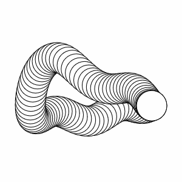
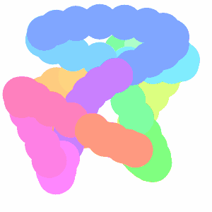
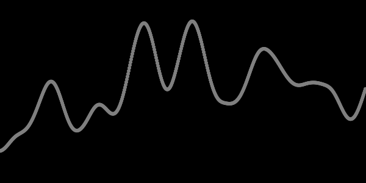

# p5.createLoop

Create animation loops with noise and GIF exports in one line of code. This library is a lightweight wrapper of [createLoop](https://www.npmjs.com/package/createloop).

Features include:
- GIF image rendering
- noise loops

## Usage

<a target="_blank" href = "https://codepen.io/peteyhayman/pen/KYYmbB">

</a>

html:
```html
<script src="https://cdn.jsdelivr.net/npm/p5@1.2.0/lib/p5.js"></script>
<script src="https://unpkg.com/p5.createloop@0.2.8/dist/p5.createloop.js"></script>
```

javascript:
```js
function setup() {
    createCanvas(400, 400)
    fill(0)
    frameRate(30)
    createLoop({duration:3, gif:true})
}

function draw() {
    background(255)
    translate(width / 2, height / 2)
    const radius = height / 3
    const x = cos(animLoop.theta) * radius
    const y = sin(animLoop.theta) * radius
    ellipse(x, y, 50, 50)
}

```

## Examples

### [Noise Loop](https://codepen.io/peteyhayman/pen/ZZZKzv)

- makes use of `animLoop.noise()`

<a target="_blank" href = "https://codepen.io/peteyhayman/pen/ZZZKzv">

</a>


### [Noise Loop 2x](https://codepen.io/peteyhayman/pen/EJJmxe)

- two noise seeds, one for x and one for y

<a target="_blank" href = "https://codepen.io/peteyhayman/pen/EJJmxe">

</a>

### [Noise Loop 1D](https://codepen.io/peteyhayman/pen/bJJWYR)

- a noise value for each x position

<a target="_blank" href = "https://codepen.io/peteyhayman/pen/bJJWYR">

</a>


### [Noise Loop 2D](https://codepen.io/peteyhayman/pen/zXXwmX)

- a noise value for each x and y position

<a target="_blank" href = "https://codepen.io/peteyhayman/pen/zXXwmX">

</a>

<!-- ###  -->
### [also works in instance mode](https://codepen.io/peteyhayman/pen/OGGmKO)


## Documentation

When a sketch is initialized the following are attatched to it:
- [createLoop()](#createloop)
  - a function to be called in `setup()`
- [animLoop](#animloop)
  - an object containing helpful properties and methods for `draw()` 

### createLoop()

This function can be called in three ways:
```javascript
createLoop() //defaults to three second duration
createLoop(options)
createLoop(duration,options)
```

#### createLoop options
| Name              | Default   | Description                                                                                     |
| ----------------- | --------- | ----------------------------------------------------------------------------------------------- |
| `duration`        | `3`       | sets the duration in seconds of the loop.                                                       |
| `framesPerSecond` | `30`      | approximate fps of the loop. This is the same as calling `frameRate()`                          |
| `noise`           | `options` | See [noise options](#noise-options)                                                             |
| `gif`             | `false`   | can also accept `true` or `options` to be passed to GIF module. See [gif options](#gif-options) |

Options can be passed as an object:

```js
createLoop({
    noise:{
        radius:3,
        seed:99
    }
})
```
or as camelCase:
```js
createLoop({
        noiseRadius:3,
        noiseSeed:99
    })
```

#### noise options
These can be passed in `createLoop` and also overridden each time `animLoop.noise()` is called. See this [Coding Train explanation](https://youtu.be/ZI1dmHv3MeM) of how noise loops work.

| Name     | Default           | Description                                                                                              |
| -------- | ----------------- | -------------------------------------------------------------------------------------------------------- |
| `radius` | `1`               | radius of the circle in a noise field to query. Similar to the concept of `frequency`                    |
| `seed`   | `random(0,99999)` | noise field offset                                                                                       |
| `theta`  | `animLoop.theta`  | By defalt is angular progress of the loop. This can be set in `animLoop.noise()` but not in `createLoop` |


#### gif options
some notes on making GIF images:
- The built in p5 `frameRate()` function will also set the delay between GIF frames
- The GIF encoder [gif.js](https://github.com/jnordberg/gif.js) uses web workers to render the GIF asynchronously 

| Name        | Default     | Description                                                                                                             |
| ----------- | ----------- | ----------------------------------------------------------------------------------------------------------------------- |
| `render`    | `true`      | render the GIF image alongside the sketch. Clicking on the image will begin downloading the GIF                         |
| `open`      | `false`     | open the gif image in a new tab or window                                                                               |
| `download`  | `false`     | download the gif automatically                                                                                          |
| `fileName`  | `image.gif` | name of the downloaded GIF file                                                                                         |
| `startLoop` | `0`         | loop index to begin recording the GIF                                                                                   |
| `endLoop`   | `1`         | loop index to end recording the GIF                                                                                     |
| `canvas`    | `<canvas>`  | the canvas to render. By default this is the sketch canvas                                                              |
| `options`   | `{}`        | options to pass to gif.js encoder. see [gif.js documentation](https://github.com/jnordberg/gif.js#user-content-options) |

### animLoop

Because the aim here is to get loopin asap, this object provides some valuable properties and methods for animating loops. See documentation on [Loop Instance](https://github.com/piratesjustar/createLoop#loop-instance) for further details.

| Name                   | Description                                                                            |
| ---------------------- | -------------------------------------------------------------------------------------- |
| `progress`             | linear progress of the loop with a range of `0 to 1`                                   |
| `theta`                | angular progress of the loop in radians with range `0 to TWO_PI`                       |
| `noise(options)`       | returns a noise value between -1 and 1. See [noise options](#noise-options)            |
| `noise1D(x,options)`   | Same as above also accepting an `x` value, providing a 1D line of noise for each frame |
| `noise2D(x,y,options)` | Same as above also accepting a `y` value, providing a 2D plane of noise                |
| `noiseSeed()`          | set the noise seed. See [noise options](#noise-options)                                |
| `noiseRadius()`        | set the noise radius. See [noise options](#noise-options)                              |

### Read more

- [codepen collection](https://codepen.io/collection/AZydLQ/#)

### Contributions

Climb aboard! Make an issue or pull request on the [gitHub page](https://github.com/piratesjustar/p5.createLoop)

### To do

- add easing functions
- set GIF size to reflect pixel density
- add draw option to stay in sync with GIF loop

### patch notes
- 0.2.0 - 27/12/2020
  - fixed warning in p5 1.2 "p5 had problems creating the global function..."
- 0.1.1 - 30/04/2019
  - added codepen examples
- 0.1.0 - 30/04/2019
  - stable release
- 0.0.21 - 30/04/2019
  - createLoop returns the animLoop object
  - README script tags reflect version
- 0.0.18 - 15/04/2019
  - updated to createLoop 0.0.7
- 0.0.17 - 15/04/2019
  - updated to createLoop 0.0.6
- 0.0.16 - 15/04/2019
  - can handle webpack without adding p5 to global namespace
- 0.0.15 - 15/04/2019
  - p5 must be externally required
- 0.0.12 - 15/04/2019
  - remove full size images from package
- 0.0.11 - 15/04/2019
  - removed p5 from bundle
  - where p5._targetFrameRate is undefined, uses p5._frameRate instead
- 0.0.10 - 15/04/2019
  - enabled use as a package
  - added p5 as dependency
- 0.0.6 - 15/04/2019
  - compressed example images
- 0.0.4 - 14/04/2019
  - fixed README image bug
- 0.0.2 - 14/04/2019
  - using script tags in examples
- 0.0.1 - 14/04/2019
  - initial release
